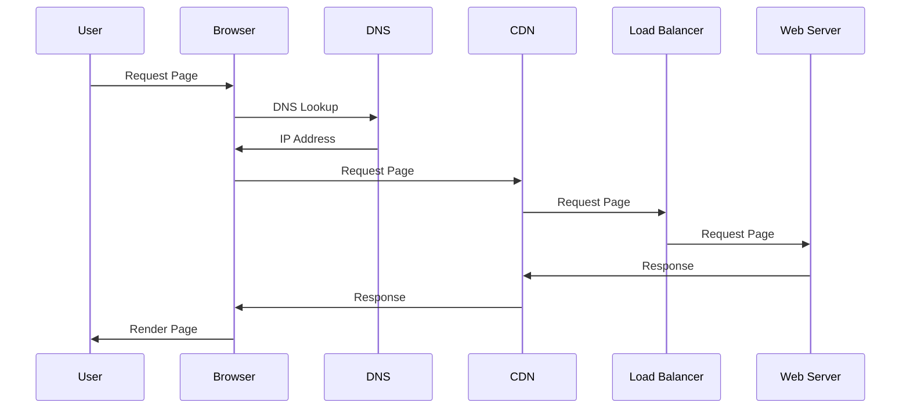

# SlackGPT

I created this starter application to explore interacting with OpenAI's ChatGPT
inside of Slack. I discovered ChatGPT is way more powerful than expected. It's
exciting, sometimes wrong, and delightful all at once.

Feedback loops with AI whereever we're working is a step-wise gain in
productivity. I want to help people leverage ChatGPT through Slack and other
tools.

- [Slack](https://slack.com/) is the place where work happens. Slack is an
  easy-to-use communication platform that helps teams stay organized,
  productive, and connected, no matter where they are. It allows users to
  communicate with each other in real-time, share files, and collaborate on
  projects. It also offers a variety of features, such as private messaging,
  group chat, and video conferencing.
- [ChatGPT](https://chat.openai.com/chat) is an AI-powered chatbot that can
  simulate natural conversations with users. It uses natural language processing
  and machine learning to understand user input and generate meaningful
  responses. Using ChatGPT, users can have conversations with a virtual
  assistant that is able to provide information and advice.
- Interacting with ChatGPT where you're working, like Slack or VSCode, is
  interesting because it allows you to stay focused and in the flow of your
  work. Imagine being able to get the benefits of ChatGPT — asking questions,
  getting explanations, and receiving guidance — without having to switch
  between applications to open the web interface. This makes it easier to stay
  on track and avoid distractions, which can help you be more productive.
  Additionally, the natural language processing capabilities of ChatGPT allow
  you to communicate with it in a way that feels intuitive and conversational,
  making it a useful tool for getting the information you need and a natural fit
  in a communication platform like Slack.
- _👆 The structure and content of these paragraphs were created together with
  ChatGPT_

# Instructions ([SETUP.md](SETUP.md))

[SETUP.md](SETUP.md) has 8 steps for installing SlackGPT in your workspace,
along with customization options. Note: this setup uses the GPT-3.5 series
transform (`text-davinci-003`) which is useful for zero-shot scenarios.
Human-in-the-loop iteration is not yet supported in OpenAI's API (only the
ChatGPT interace).

**⚠️ Privacy**

Data sent to ChatGPT is not private. Please do not send sensitive personal or
company information to it. This code is provided is for learning purposes only.

# Thank you and Attribution

To the Slack platform team and the OpenAI team, I am truly grateful for the work
that you do. Your contributions are invaluable to build these cool platforms. I
am grateful to be a part of the community that benefits from your efforts and
able to contribute back. Keep up the incredible work!

- Slack's new platform documentation: https://api.slack.com/future
  - Try prototyping and your own development using local development mode!
    https://api.slack.com/future/run
  - This code was adapted from the hello world code found:
    https://api.slack.com/tutorials/tracks/hello-world
- OpenAI API documentation: https://beta.openai.com/docs/introduction
- SlackGPT's application icon is generated through midjourney:
  https://www.midjourney.com/
- Guide to the architecture of GPT3:
  https://dugas.ch/artificial_curiosity/GPT_architecture.html
- I tweeted the beginning of this exploration using code generated from ChatGPT:
  https://twitter.com/frankc/status/1599841602729816064

# Examples

Here's how I've used ChatGPT through Slack to start structuring ideas. The
direct output is not perfect, but a useful starting point.

- 1️⃣ Take code to generate documentation
- 2️⃣ Take a list of ingredients to generate a recipe
- 3️⃣ Take a concept to generate a sequence diagram
- 4️⃣ Take a list of exercises and generate a training program

| Read code → documentation                                                                                                                                                                                                                                                        | Read ingredients → recipe                                                                                                                                                                                                                                | Take concept → diagram                                                                                                                                                                                                                                            | Take exercises → workouts                                                                                                                                                                                                                                 |
| -------------------------------------------------------------------------------------------------------------------------------------------------------------------------------------------------------------------------------------------------------------------------------- | -------------------------------------------------------------------------------------------------------------------------------------------------------------------------------------------------------------------------------------------------------- | ----------------------------------------------------------------------------------------------------------------------------------------------------------------------------------------------------------------------------------------------------------------- | --------------------------------------------------------------------------------------------------------------------------------------------------------------------------------------------------------------------------------------------------------- |
| 
3️⃣ Example diagram

